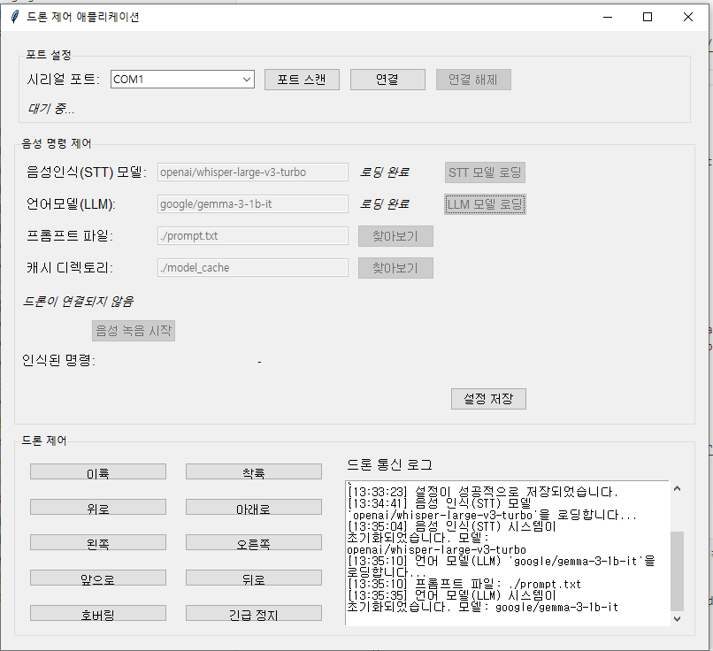

## Install python library
```bash
pip install -r requirements.txt
pip install torch torchvision torchaudio --index-url https://download.pytorch.org/whl/cu118
```

## model downloader usage

```bash
# Download Gemma (LLM)
python hf_model_downloader.py --model_id google/gemma-3-1b-it --domain causal_lm

# Download Whisper (ASR)
python hf_model_downloader.py --model_id openai/whisper-base --domain speech_recognition

```

## build (optional)
```bash
pip install pyinstaller
pyinstaller --name=VCon --console --onefile --icon=icon.png app.py
pyinstaller --name=VCon --console --onedir --icon=icon.png app.py
```
위와 같이 하면 dist 폴더에 exe 파일 생성됨  




## Reference
- [Coding drone -byrobot Documents](https://dev.byrobot.co.kr/documents/kr/products/coding_drone/library/python/coding_drone/01_intro)
- [bitcraze -crazyflie](https://www.bitcraze.io/)